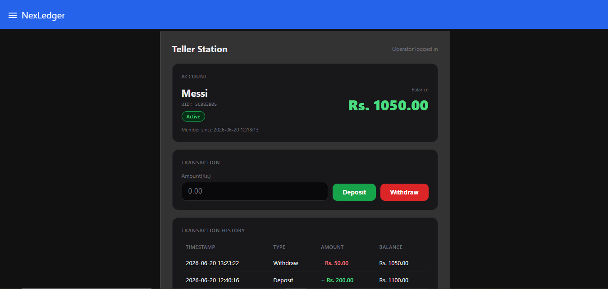
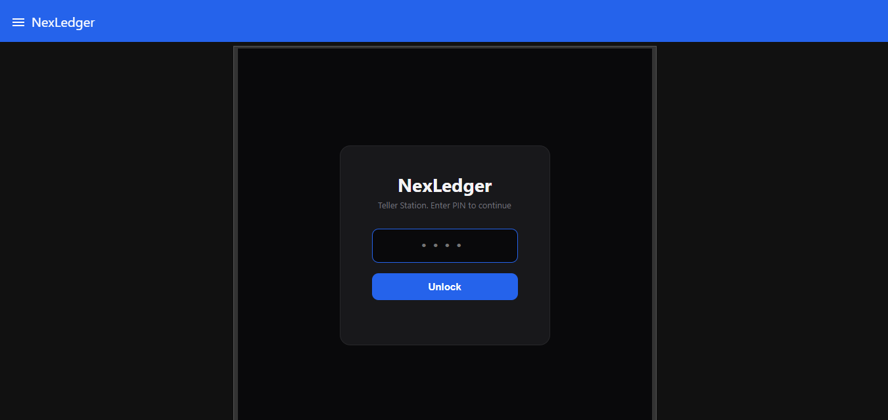
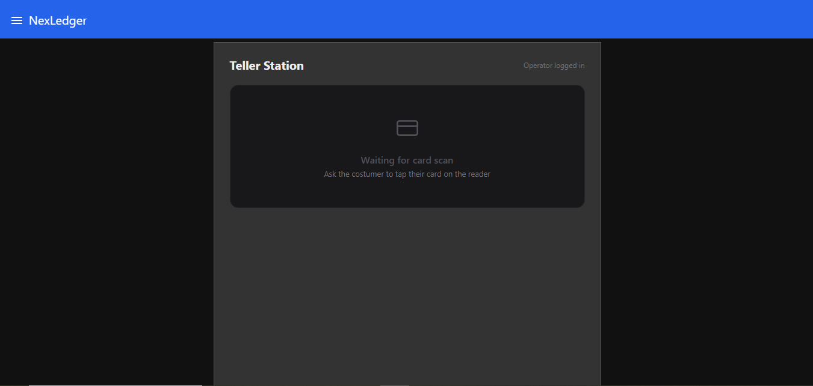
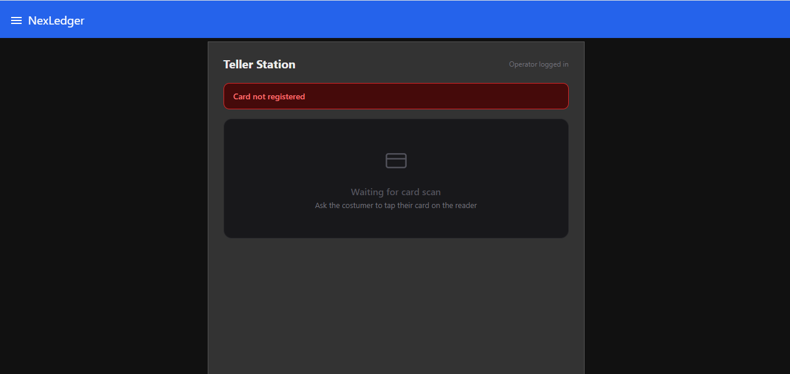
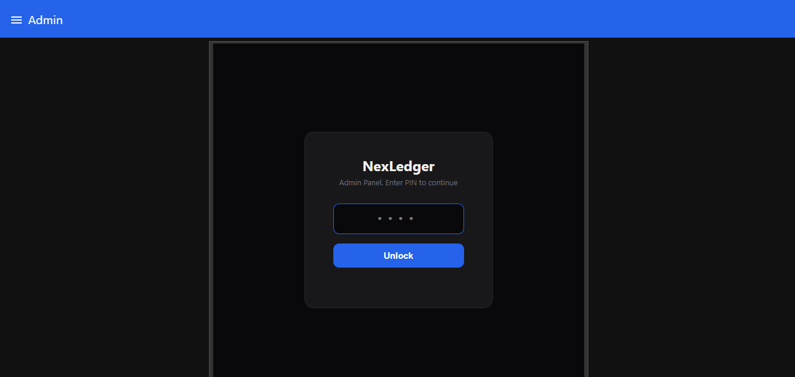
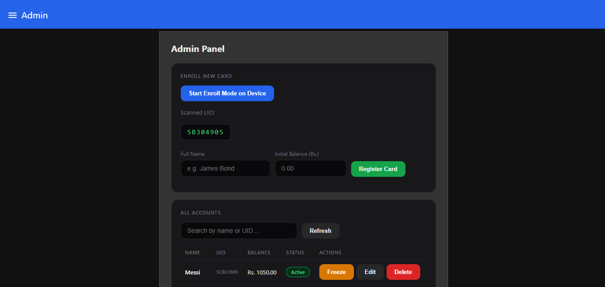
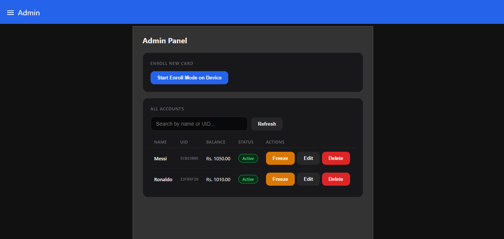

# NexLedger
### RFID-Based Balance Management and Transaction Termnal

> An ESP32 + Raspberry Pi powered balance management system; tap a MiFare card to pull up an account on a teller dashboard, deposit or withdraw funds, and keep a full timestamped transaction history. Built for school canteens, event token systems, or any counter-based cashless setup.



---

## Overview

NexLedger is a card-based balance management terminal. Each person carries a MiFare Classic RFID card linked to an account. When their card is tapped on the reader, their profile; name, balance, status, and transaction history; loads instantly on a teller-facing dashboard. The teller (a shopkeeper, canteen operator, or event staff) can then deposit or withdraw funds on their behalf, with every transaction logged and timestamped.

It's not built to move real money, there's no payment gateway involved. Think of it more like a closed-loop balance system: a parent tops up a card once, and a canteen operator deducts from it on every purchase, or an event organizer issues cards loaded with credit that attendees spend at different stalls.

The system runs on the same ESP32 + MQTT + Node-red + SQLite architecture as [NexEntry](https://github.com/razihaider14/NexEntry) and [Sentinel](https://github.com/razihaider14/Sentinel), reusing the same Raspberry Pi backend setup. Though NexEntry had a completely different Node-red layout.

---

## Features

### Card and Account Management
- RFID card tap → instant account lookup and dashboard load
- Duplicate=tap protection → re-scanning the same card while it's already loaded does nothing, scanning a different card switches instantly
- Account freeze / unfreeze from the admin panel
- Full account editing → name, balance, status
- Account deletion

### Transactions
- Deposit and withdraw, processed by the teller after a card tap
- Insufficient-funds protection on withdrawals
- Every transaction logged with type, amount, resulting balance, and timestamp
- Per-account transaction history, most recent first

### Dashboard
- Dark, banking-style UI with blue accent theme
- Two separate views; Teller station and Admin Panel; on separate Node-red dashboard tabs
- PIN-protected access for both teller and admin views, independently
- Live toast notifications for transaction results and declined scans
- Declined scans (unregistered or frozen cards) show feedback directly on the dashboard, not just the LCD

### Card Erollment (Admin)
- Enrollment mode triggered from the dashboard
- ESP32 scans the new card and reports its UID to the admin panel
- Admin assigns a name and initial balance, registers the card
- Search / filter across all enrolled accounts

### Security
- MQTT over TLS (port 8883, Mosquitto with CA certificate)
- Two independent PIN layers; operator PIN for the teller dashboard, separate admin PIN for account management
- Wifi and MQTT broker credentials configured via WiFiManager's captive portal on first boot, nothing hardcoded, no reflashing needed to change networks

---

## Hardware

| Component | Details |
|---|---|
| Microcontroller | ESP32 Wroom-32 |
| RFID Reader | RC522 (SPI) |
| RFID Cards | MiFare Classic 13.56MHz x 12 |
| Display | 16x2 I2C LCD (0x27) |
| LEDs | Green, Red |
| Buzzer | Active Buzzer |
| Backend | Raspberry Pi (Mosquitto + Node-red + SQLite) |
| Broker | Mosquitto (TLS, port 8883)
| Dashboard | Node-red with SQLite |

---

## Wiring

| RC522 Pin | ESP32 Pin |
|---|---|
| SDA (SS) | 5 |
| SCK | 18 |
| MOSI | 23 |
| MISO | 19 |
| RST | 4 |

| Component | ESP32 Pin |
|---|---|
| LCD SDA | 21 |
| LCD SCL | 22 |
| Green LED | 26 |
| Red LED | 25 |
| Buzzer | 27 |

> **Power note** RC522 is 3.3V only, it's power pin goes to 3.3V. LCD I2C can work on both 5V or 3.3V depending on the module.

---

## Project Structure

```
NexLedger/
├── firmware/
│    ├── firmware.ino
│    ├── config.h
│    ├── rfid_handler.h/.cpp
│    ├── feedback.h/.cpp
│    ├── display.h/.cpp
│    └── mqtt_handler.h/.cpp
├── dashboard/
│    ├── flows.json
│    ├── main_dashboard.html
│    └── admin_dashboard.html
└── Images/
     └── *.png
```

## MQTT Topics

| Topic | Direction | Purpose |
|---|---|---|
| `ledger/scan` | ESP32 → Pi | Card tapped, sends UID |
| `ledger/status` | ESP32 → Pi | Heartbeat |
| `ledger/result` | Pi → ESP32 | Transaction/scan result (approved/declined + balance) |
| `ledger/cmd/enroll` | Pi → ESP32 | Start enrollment mode |
| `ledger/cmd/enroll/scanned` | ESP32 → Pi | UID scanned during enrollment |

---

## Setup

### 1. Mosquitto (Raspberry Pi)
```bash
sudo apt install mosquitto mosquitto-clients
```
Configure TLS with your CA certificate and set credentials. Enable port 8883.

### 2. Node-red (Raspberr Pi)
```bash
bash <(curl -sL https://raw.githubusercontent.com/node-red/linux-installers/master/deb/update-nodered)
```
Install required packages:
```bash
cd~/.node-red
npm install node-red-dashboard-red-sqlite
```
Import `flows.json` via Node-red editor → Top right Menu → Import.

The Main dashboard and admin dashboard template nodes will already have their html code, it is given here for reference.

Configure the MQTT broker node with your Pi's IP, port 8883, and TLS certificate. Update the SQLite database path in `sqlitedb` config node to match your file system (e.g. `/home/<user>/nexledger/nexledger.db`), nd create that folder beforehand:
```bash
mkdir -p ~/nexledger
```

### 3. ESP32 Firmware
Open `firmware` in Arduino IDE. Fill in the CA certificate in `config.h`:
```cpp
static const char CA_CERT[] = R"EOF(
-----BEGIN CERTIFICATE-----
your_ca_cert_here
-----END CERTIFICATE-----
)EOF";
```

Required libraries (Arduino Library Manager):
- `WiFiManager` by tzapu
- `MFRC522` by GithubCommunity
- `LiquidCrystal_I2C` by Frank de Brabander
- `PubSubClient` by Nick O'Leary
- `ArduinoJson` by Benoit Blanchon

Flash to ESP32. On first boot (or after erased flash), it starts an access point called `NexLedger-Setup`. Connect to it from you phone or laptop, fill in your WiFi SSID / password and MQTT broker IP / username / password, and save. The ESP32 reboots and connects automatically from then on.

### 4. Card Enrollment
1. Open dashboard → `http://<pi-ip>:1880/ui`
2. Go to the **Admin** tab → enter PIN `1234`
3. Click **Start Enroll Mode on Device**
4. Tap a card on the reader → its UID appears on the dashboard
5. Enter a name and initial balance → **Register Card**
6. Repeat for each card

### 5. Using the Teller Station
1. Go to the **NexLedger** tab → enter PIN `12345`
2. Tap a registered card → account loads with balance and history
3. Enter an amount → **Deposit** or **Withdraw**

---

## Dashboard Screenshots

### Teller, Login


### Teller, No Card Scanned


### Teller, Account Loaded


### Teller, Declined Card


### Admin, Login


### Admin, Enrollment


### Admin, Account Management


---

## Built With

- **ESP32**: firmware in C++ (Arduino framework)
- **Node-Red**: flow-based backend + dashboard
- **Mosquitto**: MQTT broker with TLS
- **SQLite**: account and transaction persistence
- **MiFare Classic**: RFID cards(UID-based identification)
- **WiFiManager**: runtime WiFi/MQTT provisioning via captive portal

---

## Related Projects

- [NexEntry](https://github.com/razihaider14/NexEntry): ESP32 RFID access control and attendence system with servo door lock, demo mode, and live analytics dashboard
- [Sentinel](https://github.com/razihaider14/Sentinel): ESP32 smart lock with TOTP, TLS, MQTT. and Node-red dashboard